# VR_Assignment1_NikitaKiran_IMT2022028


Using OpenCV and Python for image detection, segmentation and stitching.

### Link to GitHub Repo: [VR_Assignment1_NikitaKiran_IMT2022028](https://github.com/NikitaKiran/VR_Assignment1_NikitaKiran_IMT2022028.git)

## Table of Contents
1. [Installation and Setup](#installation-and-setup)
2. [Coin Detection and Segmentation](#coin-detection-and-segmentation)
3. [Image Stitching for Panorama Creation](#image-stitching-for-panorama-creation)


## Installation and Setup

### Step 1: Install Dependencies  
Install the required Python packages:

```bash
pip install opencv-python numpy matplotlib
```

### Step 2: Prepare Input Images  
- Place the input image for **coin detection** (`coin_detection_input.jpg`) inside the `inputs/` folder.
- Place the three images for **image stitching** inside `inputs/panorama_inputs1/` (e.g., `1.jpg`, `2.jpg`, `3.jpg`).

### Step 3: Running the Code
1. After ensuring the images are in the correct path and the dependencies are installed, navigate to the project directory in the terminal.
2. Run the code for Part 1 by executing the following command:
   ```bash
   python coin_detection.py
4. Run the code for Part 2 by executing the following command:
   ```bash
   python image_stitching.py

---

## Coin Detection and Segmentation


### Input Image:

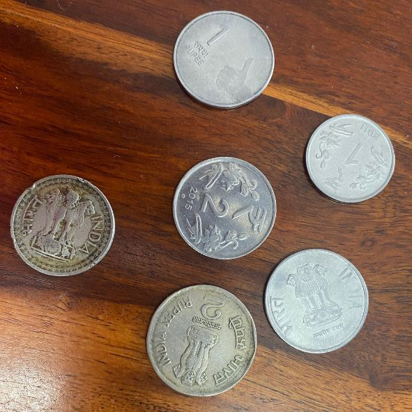

### Methodology

1. **Preprocessing**:
   - The input image is first converted to grayscale for easier processing.
   - A **Gaussian Blur** is applied to reduce noise.

2. **Edge Detection & Contour Detection**:
   - **Canny Edge Detection** is used to identify object edges.
   - **Morphological closing operation** is done to close small gaps in edges.
   - Contours are extracted using `cv2.findContours()`.

3. **Segmentation & Counting**:
    - Small contours are filtered out on the basis of area.
    - A mask is obtained for each contour. 
    - The mask is applied on the original image to segment out the coin.
    - A bounding box is drawn around the coin and the individual coins are cropped and displayed seperately
    - The total number of detected coins are displayed.


### Results

1. **Edge Detection & Outlining:**  
   - Coins in the image are successfully detected and highlighted with contours.
     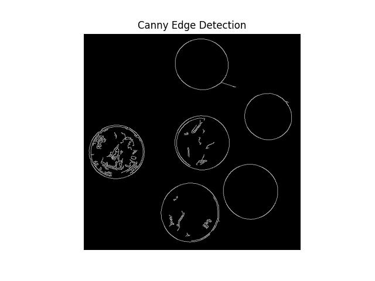
     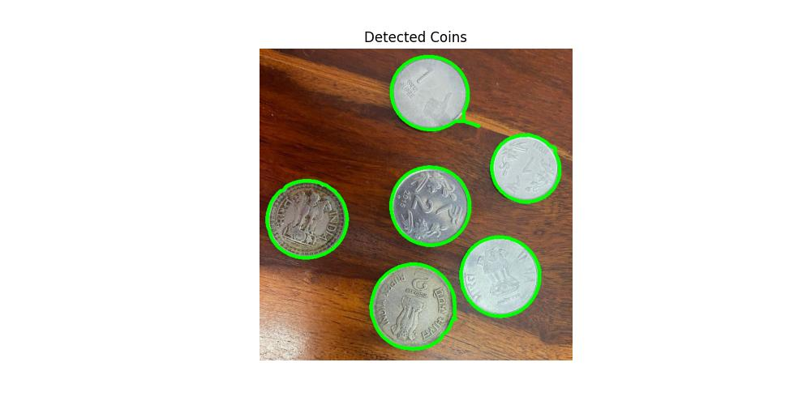

   
2. **Segmentation and Counting:**  
   - Each coin is **accurately isolated**.
   - Filtering out invalid contours helps avoid incorrect segmentation.
   - The total number of coins is correctly displayed.
     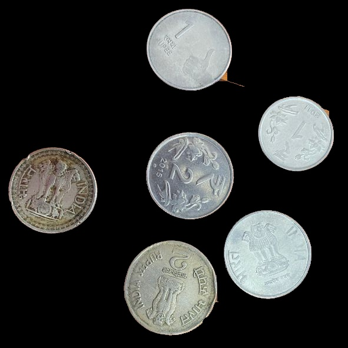
     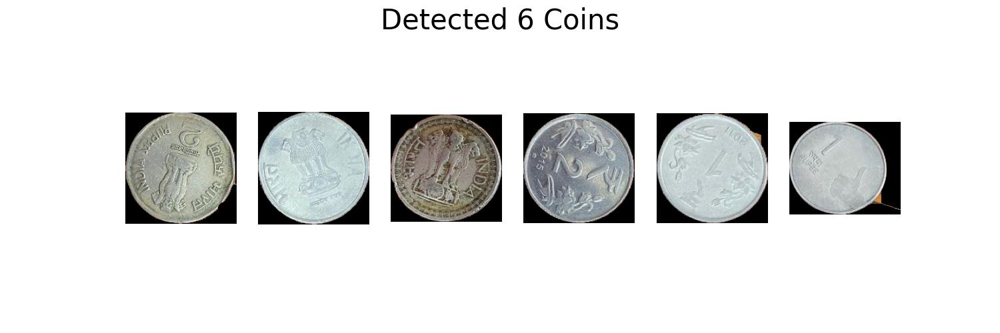
     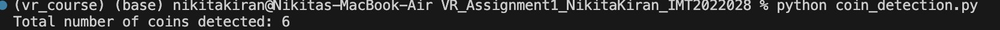

---

### Observations

- **Gaussian Blur** significantly improved edge detection by reducing background noise. However the size of the kernel played a very important role. If it was too small, noise still remained and the edge detection had many unecessary edges. If the kernel was too large, blurring was too much and many coin edges were undetected.
- **Threshold values for Canny edge detection**: The best output was obtained when the lower and upper thresholds were in a ratio of around 1:3.
- **Filtering out smaller contours** ensured that many invalid countours were not wrongly counted as coins.

---

## Image Stitching for Panorama Creation


### Input Images:


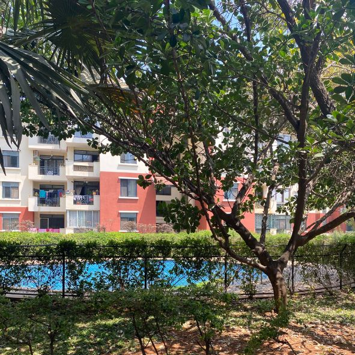
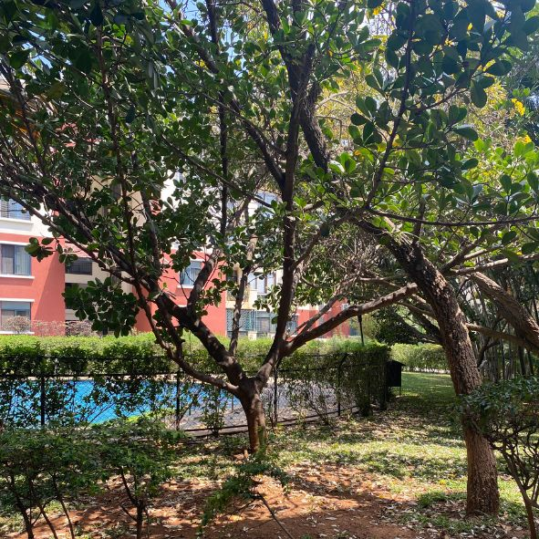

### Methodology  

#### 1. Keypoint Detection  
We used the **SIFT** feature detector to identify key points in each of the overlapping images. SIFT is invariant to rotation and scale, making it suitable for feature detection in image stitching.  

#### 2. Feature Matching  
The **Brute-Force Matcher (BFMatcher)** with was used to match key points between consecutive images. Lowe's ratio test was used to ensure only good matches were retained. The ratio test compares the distance of the closest match to the distance of the second closest match. If the ratio of these distances is below a certain threshold ( 0.75), the match is considered good.

#### 3. Homography Transformation  
A **homography matrix** was computed using **RANSAC (Random Sample Consensus)** to align the images based on matched key points. This transformation ensures proper perspective warping and alignment.  

#### 4. Image Warping and Stitching  
Each image was warped using **perspective transformation**, aligning it to the previous image in the sequence. The images were then blended (using linear blending) to form a seamless panorama.  

#### 5. Cropping  
To remove black regions introduced by warping, threshholding followed by bounding box detection and cropping was used, ensuring the final panorama had no unnecessary black spaces.  

---

### Results  


**Key Points Visualization:**  
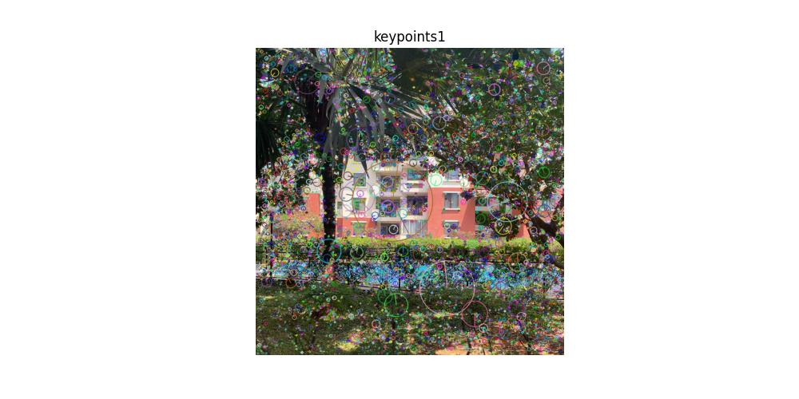 
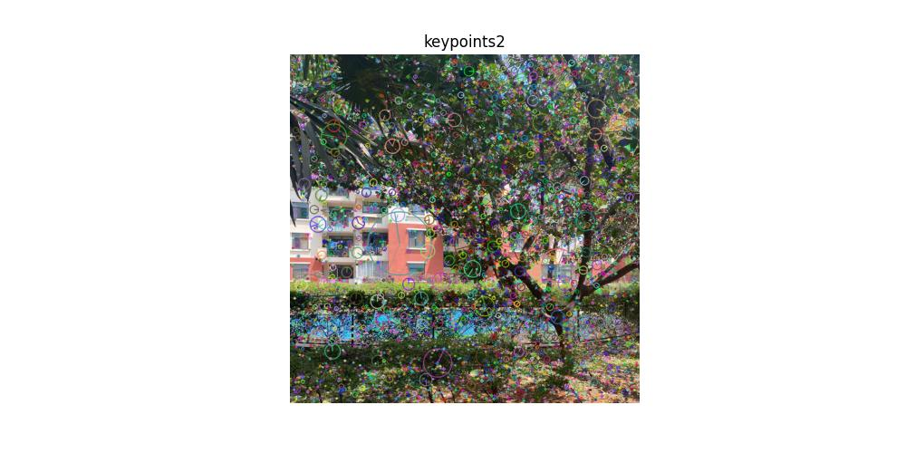 
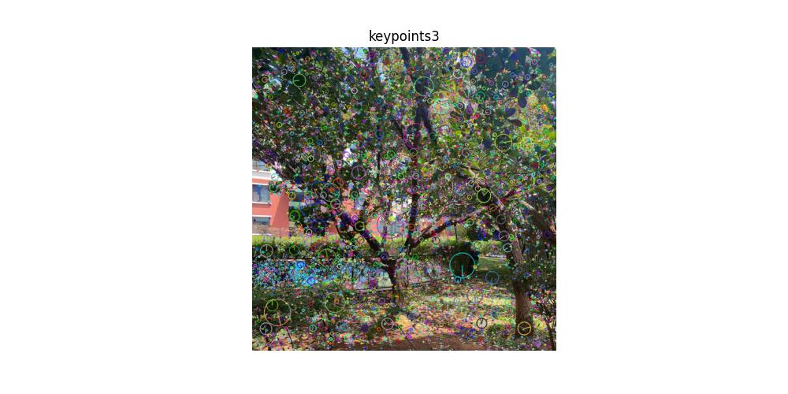  

**Visualisation of 50 best matches**

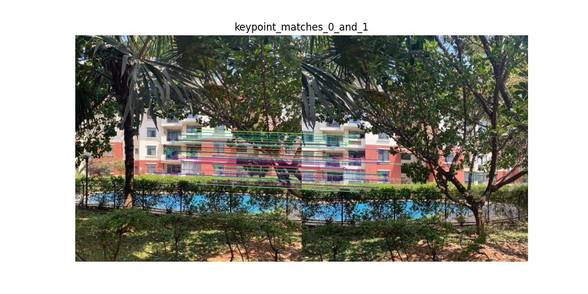 
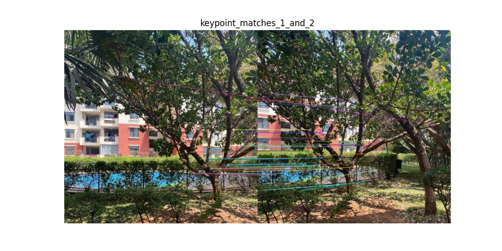 


#### Final Stitched Panorama  
The stitched image, obtained after key point detection, feature matching, homography transformation, warping and blending.  

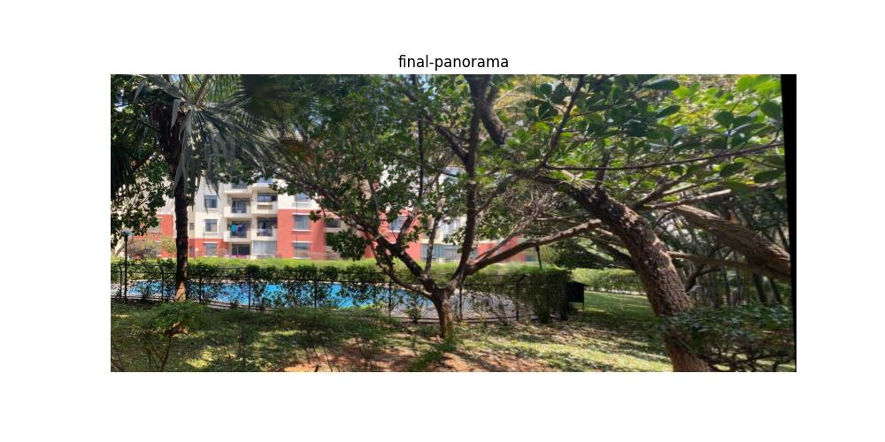 

---

### Observations  

- Most of the keypoints were correctly matched in the images. However there were a few outlier matches. 
- The RANSAC-based homography estimation was able to handle outlier matches.
- Blending helped in reducing seams. 
- Black regions were successfully cropped out to improve the final output.  


