# VR_Assignment1_NikitaKiran_IMT2022028


Using OpenCV and Python for image detection, segmentation and stitching.

### Link to GitHub Repo: [VR_Assignment1_NikitaKiran_IMT2022028](https://github.com/NikitaKiran/VR_Assignment1_NikitaKiran_IMT2022028.git)

## Table of Contents
1. [Installation and Setup](#installation-and-setup)
2. [Coin Detection and Segmentation](#coin-detection-and-segmentation)
3. [Image Stitching for Panorama Creation](#image-stitching-for-panorama-creation)


## Installation and Setup

### Step 1: Install Dependencies  
Install the required Python packages:

```bash
pip install opencv-python numpy matplotlib
```

### Step 2: Prepare Input Images  
- Place the input image for **coin detection** (`coin_detection_input.jpg`) inside the `inputs/` folder.
- Place the three images for **image stitching** (`1.jpg`, `2.jpg`, `3.jpg`) inside `inputs/panorama_inputs1/`.

### Step 3: Running the Code
1. After ensuring the images are in the correct path and the dependencies are installed, navigate to the project directory in the terminal.
2. Run the code for Part 1 by executing the following command:
   ```bash
   python coin_detection.py
4. Run the code for Part 2 by executing the following command:
   ```bash
   python image_stitching.py

### Step 4: Viewing Outputs
- The outputs for coin detection are saved in `coin_detection_outputs/`
- The outputs for image stitching are saved in `panorama_outputs1/`

---

## Coin Detection and Segmentation


### Input Image 1:


### Input Image 2:

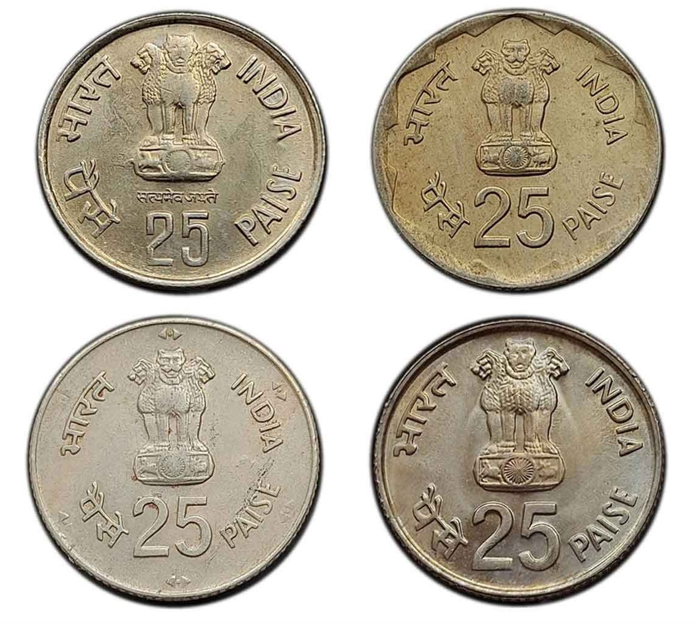

### Input Image 3:

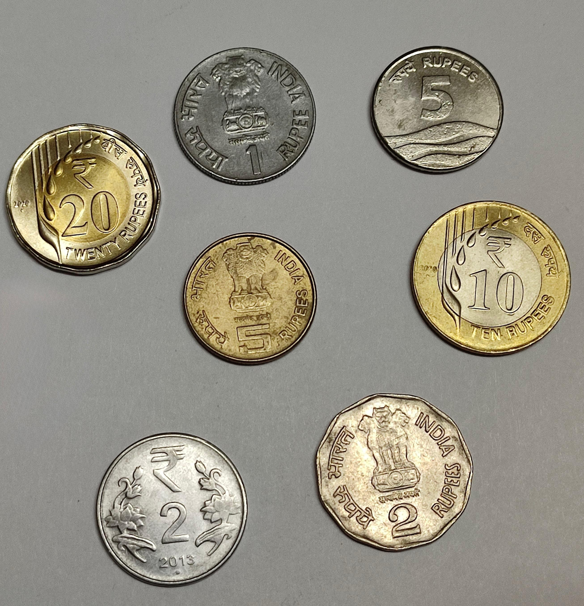

### Methodology

1. **Preprocessing**:
   - The input image is first converted to grayscale for easier processing.
   - A **Gaussian Blur** is applied to reduce noise.

2. **Edge Detection & Contour Detection**:
   - **Canny Edge Detection** is used to identify object edges.
   - **Morphological closing operation** is done to close small gaps in edges.
   - Contours are extracted using `cv2.findContours()`.

3. **Segmentation & Counting**:
    - Small contours are filtered out on the basis of area.
    - A mask is obtained for each contour. 
    - The mask is applied on the original image to segment out the coin.
    - A bounding box is drawn around the coin and the individual coins are cropped and displayed separately
    - The total number of detected coins are displayed.


### Results

1. **Edge Detection & Outlining:**  
   - Coins in the image are successfully detected and highlighted with contours.

   #### For Image 1:
     
     
   
   #### For Image 2:
   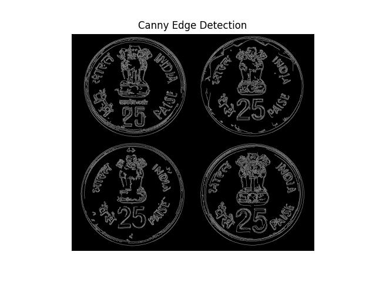
   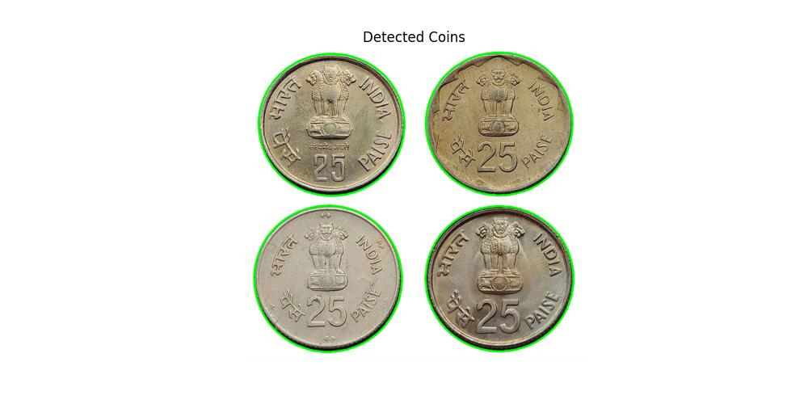

   #### For Image 3:
   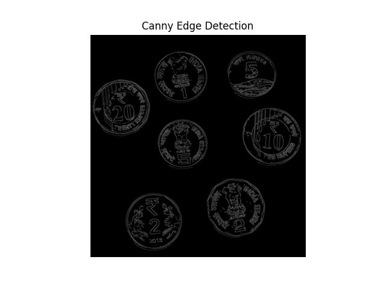
   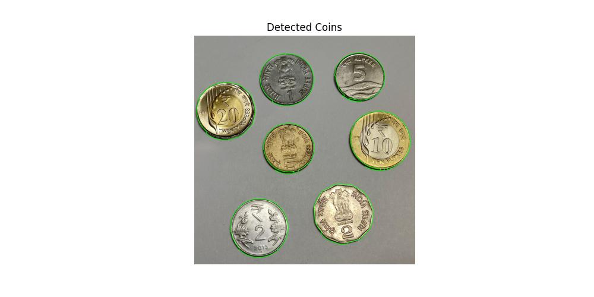
   
2. **Segmentation and Counting:**  
   - Each coin is **accurately isolated**.
   - Filtering out invalid contours helps avoid incorrect segmentation.
   - The total number of coins is correctly displayed.

   #### Image 1 Results:
     
     
     

   #### Image 2 Results:
     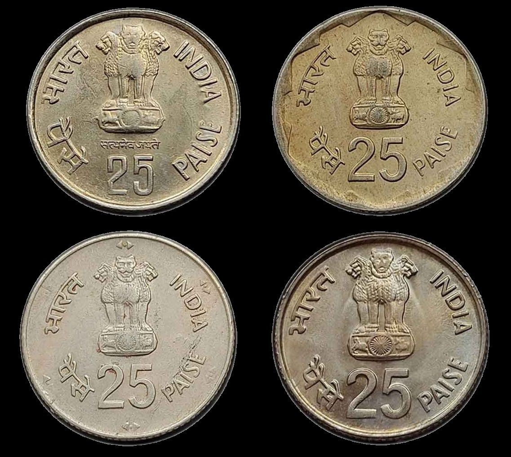
     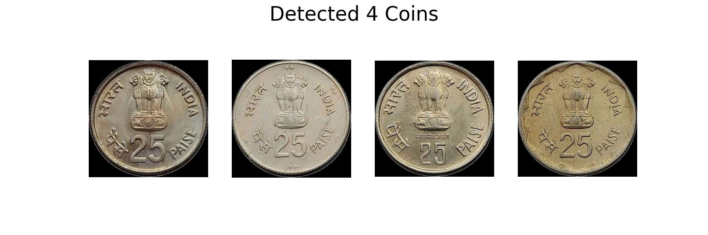
   
   
   #### Image 3 Results:
     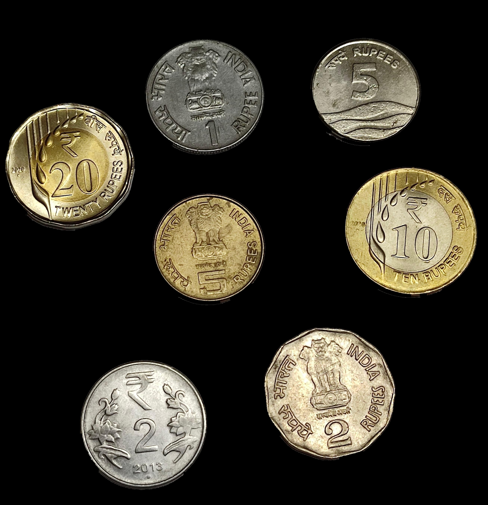
     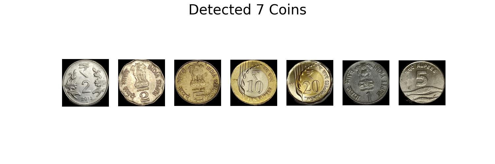


---

### Observations and Experiment Details

- **Gaussian Blur** significantly improved edge detection by reducing background noise. However the size of the kernel played a very important role. While using a very small kernel, noise still remained and the edge detection had many unnecessary edges. However if the kernel  used was very large, blurring was too much and many coin edges were undetected.
- **Threshold values for Canny edge detection**: After experimenting with several different values, the best output was obtained when the lower and upper thresholds were in a ratio of around 1:3.
- Without the **morphological closing operation**, a few of the coin edges were broken and resulted in incomplete contours.
- **Filtering out smaller contours** ensured that many invalid contours were not wrongly counted as coins.

---

## Image Stitching for Panorama Creation


### Input Images 1:

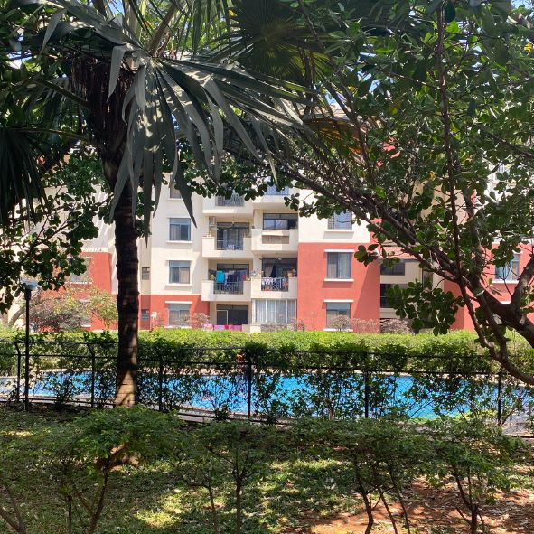


### Input Images 2:

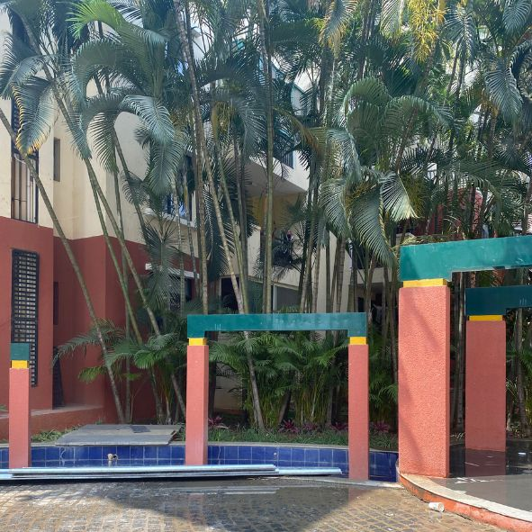
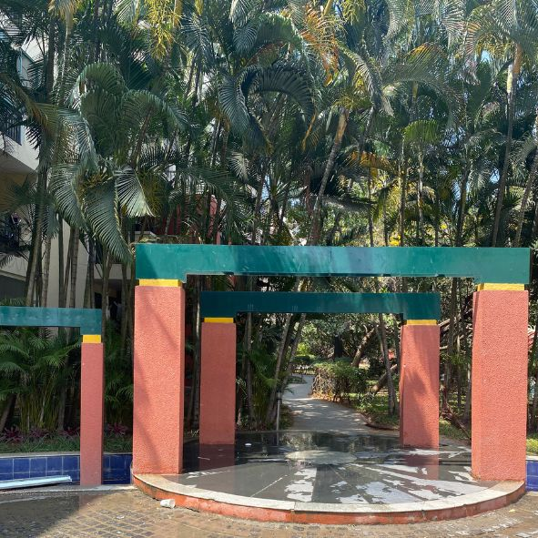
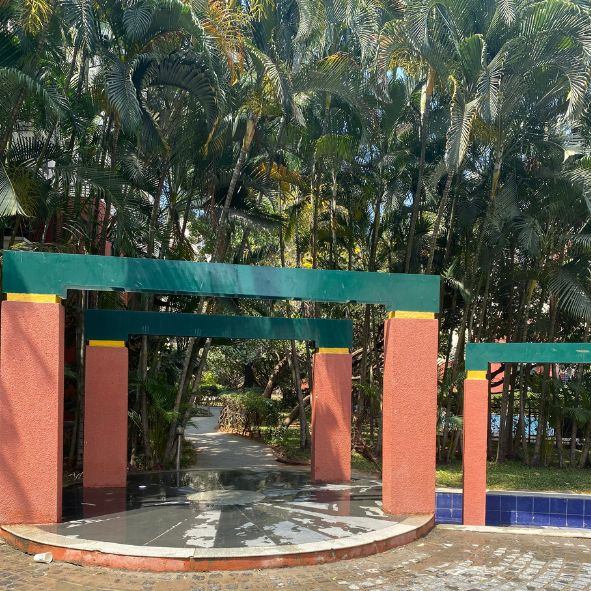

### Methodology  

#### 1. Keypoint Detection  
I used the **SIFT** feature detector to identify key points in each of the overlapping images. SIFT is invariant to rotation and scale, making it suitable for feature detection in image stitching.  

#### 2. Feature Matching  
The **Brute-Force Matcher (BFMatcher)** was used to match key points between consecutive images. Lowe's ratio test was used to ensure only good matches were retained. The ratio test compares the distance of the closest match to the distance of the second closest match. If the ratio of these distances is below a certain threshold ( 0.75), the match is considered good.

#### 3. Homography Transformation  
To align overlapping images accurately, a **homography matrix** was computed using **RANSAC (Random Sample Consensus)**. This transformation maps corresponding key points between image pairs, ensuring proper perspective correction and minimizing alignment errors caused by outliers.
  

#### 4. Image Warping and Stitching  
Each image was warped using the estimated homography matrix, transforming it into the reference frame of the previous image in the sequence. The warped images were then stitched together using **linear blending**, ensuring a smooth transition between overlapping regions. This prevents visible seams.


#### 5. Cropping  
To remove black regions introduced by warping, thresholding followed by bounding box detection and cropping was used, ensuring the final panorama had no unnecessary black spaces.  

---

### Results  


**Key Points Visualization:**  
####  For Example 1
 
 
 

####  For Example 2
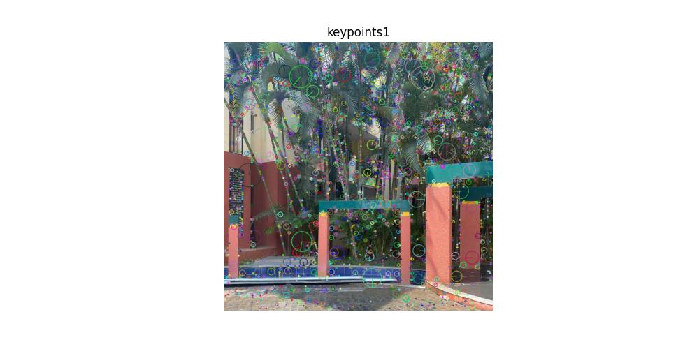 
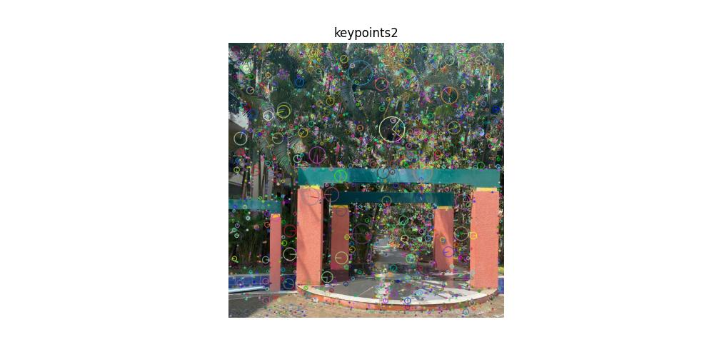 
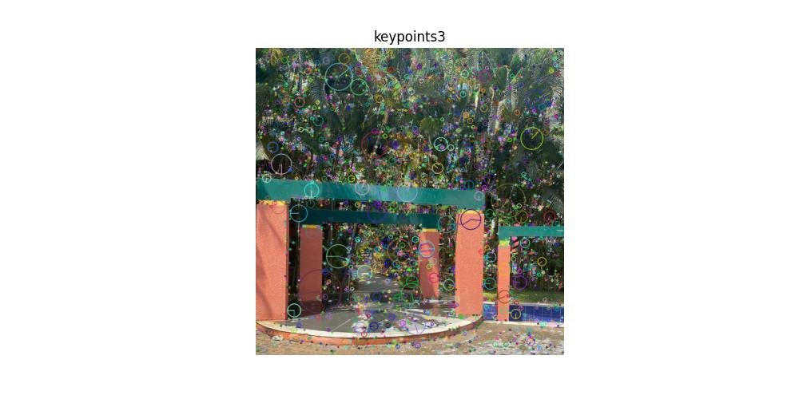 

**Visualisation of 50 best matches**
####  For Example 1
 
 

####  For Example 2
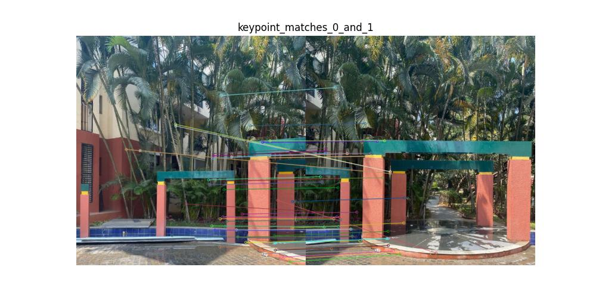 
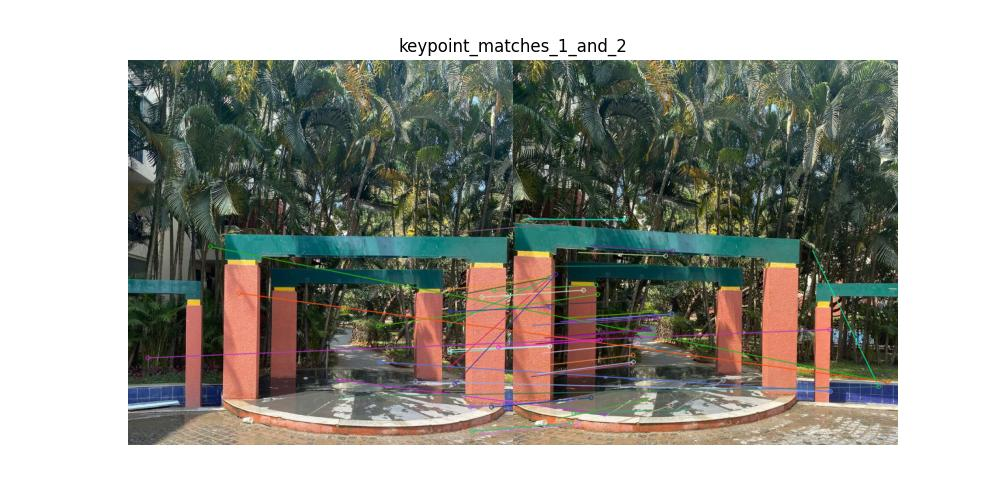 

#### Final Stitched Panorama  
The stitched image, obtained after key point detection, feature matching, homography transformation, warping and blending.  

####  For Example 1
 

####  For Example 2
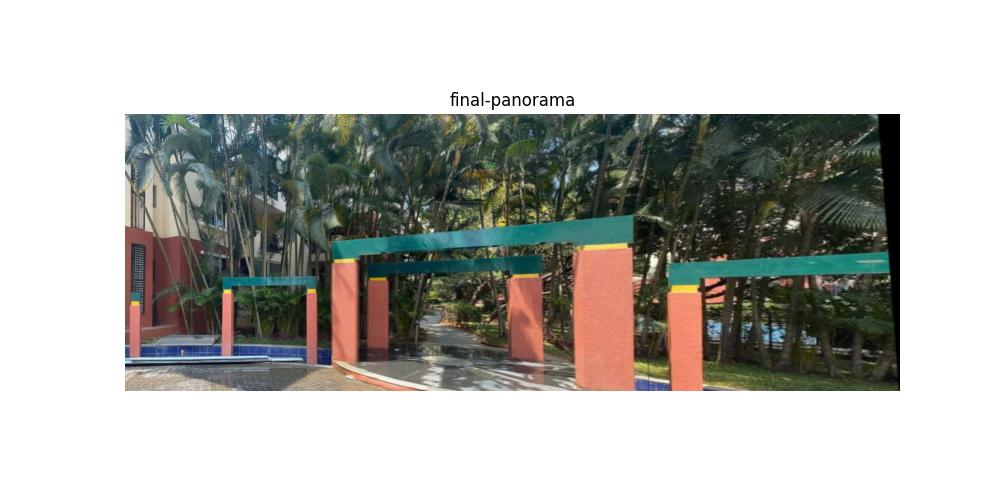 
---

### Observations  and Experiment Details

- Most of the keypoints were correctly matched in the images. However there were a few outlier matches. 
- The RANSAC-based homography estimation was able to handle outlier matches.
- Stitching the images together without blending resulted in seams. Thus I used linear blending to ensure the images were stitched together seamlessly.
- Without cropping, black regions were present at the edges of the image. Thus cropping was needed to remove them.


